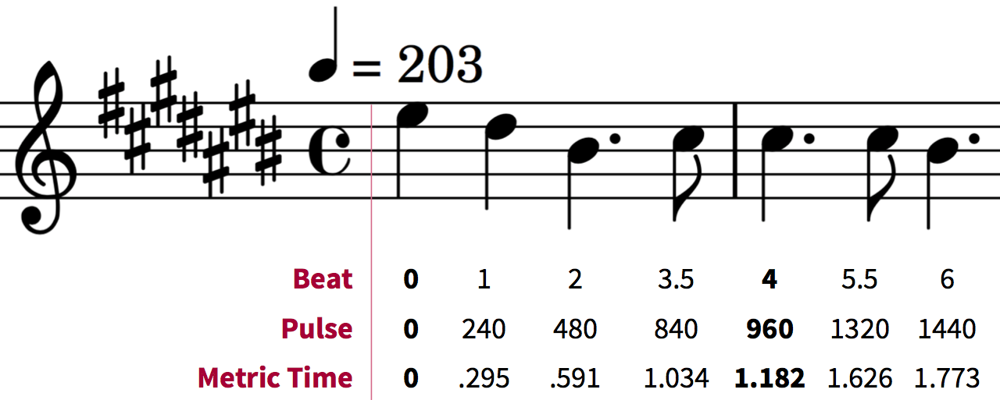
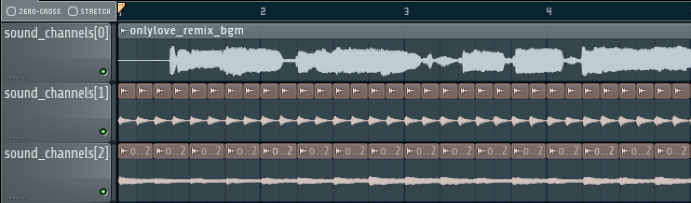
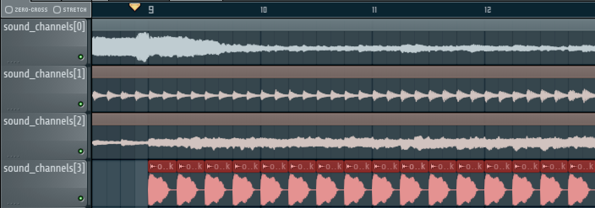

==========================
bmson format specification
==========================

Version 1.0.0-beta (2015/12/26)

Links
=====

- Official Site:
  https://bmson.nekokan.dyndns.info/
- how_to_bmson (Japanese):
  http://www40.atwiki.jp/laser_bm/pages/110.html
- #bmson Creaion Notes (English):
  https://docs.google.com/document/d/1gQKPWApeL03aO09-II7slxTeuvm3HO_FmY1D4chRvOQ

General
=======

bmson is a file format based on JSON.

Compared to BMS, it is a much easier format to handle on both artist and developer ends, as the format expects games to slice the sound stems during play rather than artists having to do all this work beforehand. This also removes the limit of keysounds you can have in a single chart, as well as it lets chart creators to use any part of any sound they want.

For developers, it is easier to implement than BMS due to it being based on JSON, thus a JSON parser can make implementation of the format much quicker.

.. admonition:: Notes

  - While this format is based on JSON, some bmson examples shown here are written in `YAML notation`_ instead, for conciseness and readability.

.. _`YAML notation`: http://www.yaml.org/spec/1.2/spec.html

Format Overview
===============

The format follows `Web IDL (Second Edition)`_

.. code-block:: c

  // top-level object
  dictionary Bmson {
      DOMString      version;        // bmson version
      BmsonInfo      info;           // information, e.g. title, artist, …
      BarLine[]?     lines;          // location of bar-lines in pulses
      BpmEvent[]?    bpm_events;     // bpm changes
      StopEvent[]?   stop_events;    // stop events
      SoundChannel[] sound_channels; // note data
      BGA            bga;            // bga data
  }

  // header information
  dictionary BmsonInfo {
      DOMString     title;                 // self-explanatory
      DOMString     subtitle = "";         // self-explanatory
      DOMString     artist;                // self-explanatory
      DOMString[]?  subartists = [];       // ["key:value"]
      DOMString     genre;                 // self-explanatory
      DOMString     mode_hint = "beat-7k"; // layout hints, e.g. "beat-7k", "popn-5k", "generic-nkeys"
      DOMString     chart_name;            // e.g. "HYPER", "FOUR DIMENSIONS"
      unsigned long level;                 // self-explanatory
      double        init_bpm;              // self-explanatory
      double        judge_rank = 100;      // relative judge width
      double        total = 100;           // relative lifebar gain
      DOMString?    back_image;            // background image filename
      DOMString?    eyecatch_image;        // eyecatch image filename
      DOMString?    banner_image;          // banner image filename
      DOMString?    preview_music;         // preview music filename
      unsigned long resolution = 240;      // pulses per quarter note
  }

  // bar-line event
  dictionary BarLine {
      unsigned long y; // pulse number
  }
  // sound channel
  dictionary SoundChannel {
      DOMString name; // sound file name
      Note[] notes;   // notes using this sound
  }

  // sound note
  dictionary Note {
      any x;           // lane
      unsigned long y; // pulse number
      unsigned long l; // length (0: normal note; greater than zero (length in pulses): long note)
      boolean c;       // continuation flag
  }

  // bpm note
  dictionary BpmEvent {
      unsigned long y; // pulse number
      double bpm;      // bpm
  }

  // stop note
  dictionary StopEvent {
      unsigned long y;        // pulse number
      unsigned long duration; // stop duration (pulses to stop)
  }

  // for any custom classes of timing,
  // follow format as bpmevent or stopevent.
  // bga
  dictionary BGA {
      BGAHeader[] bga_header;   // picture id and filename
      BGAEvent[]  bga_events;   // picture sequence
      BGAEvent[]  layer_events; // picture sequence overlays bga_notes
      BGAEvent[]  poor_events;  // picture sequence when missed
  }

  // picture file
  dictionary BGAHeader {
      unsigned long id; // self-explanatory
      DOMString name;   // picture file name
  }

  // bga note
  dictionary BGAEvent {
      unsigned long y;  // pulse number
      unsigned long id; // corresponds to BGAHeader.id
  }

.. _`Web IDL (Second Edition)`: https://heycam.github.io/webidl/

Changelog
=========

1.0.0 (from 0.21)
-----------------

Breaking Changes
~~~~~~~~~~~~~~~~

- Change all *camelCased* fields to *snake_case*.

  - ``soundChannel``
  - ``judgeRank``
  - ``initBPM``
  - ``bgaHeader``
  - ``bgaNotes``
  - ``layerNotes``
  - ``poorNotes``
  - ``ID``

- Rename fields

  - ``bpmNotes`` → ``bpm_events``
  - ``stopEvents`` → ``stop_events``

- Remove fields

  - ``BarLine.k``

    - It is unnecessary for common bmson format

- Separate ``EventNote`` into ``BpmEvent`` and ``StopEvent``

  - ``bpmNotes.v`` is now ``BpmEvent.bpm``
  - ``stopNotes.v`` is now ``StopEvent.duration``

- Time unit has been changed to *pulse*
- ``BMSInfo.total`` is changed to relative value

Non Breaking Changes
~~~~~~~~~~~~~~~~~~~~

- Add fields

  - ``version``
  - ``BMSInfo.subtitle``
  - ``BMSInfo.subartists``
  - ``BMSInfo.mode_hint``
  - ``BMSInfo.chart_name``
  - ``BMSInfo.back_image``
  - ``BMSInfo.eyecatch_image``
  - ``BMSInfo.banner_image``
  - ``BMSInfo.preview_music``
  - ``BMSInfo.resolution``

Terminologies
=============

Time Units
----------

There are three types of time unit:

metric time (SI time): t
  Measured in *second*.

musical time: b
  Measured in *beats*. The duration of a beat depends on BPM and stop notes. 1 beat = 1 quarter note in 4/4 measure.

clock time (MIDI clock): y
  Measured in *pulses*. A beat is split into discrete, equally-spaced pulses. The number of pulses in a beat depends on the beat resolution. Also known as *ticks* (programmer term) or *rows* (StepMania_ term).

.. _StepMania: http://www.stepmania.com/

Beat Resolution
---------------

This is the number of pulses per one quarter note in a 4/4 measure. By default, this value is ``240``, which means that 1 quarter note is split into 240 pulses [#]_.

   Example between beat, pulse, and metric time.

.. admonition:: Notes

  In this document, we assume that resolution is always ``240``.

.. [#] Many music games commonly use 48 pulses per quarter note (which means 192 pulses per 4/4 measure). It can handle up to 64th, 96th, and 192nd note, but fails to accommodate quintuplet notes (where a beat is divided into 5 equal intervals). 240 is the lowest common denominator of 48 and 5, and can represent up to 80th, 120th, and 240th note.

Dimensions (what is *x* and *y*)
--------------------------------

bmson is designed to be adaptable to multiple types of music games. For most music-based games, these are usually 2 common dimensions:

- **Time**: When to activate?
- **Player channel**: How to activate? (For instance, in IIDX-style games, there are 8 playable channels: 1 turntable and 7 buttons).

Given these two common dimensions, we can represent a note using an (x, y) coordinate like a piano roll, where x-coordinate represents the player channel, and y-coordinate represents the musical time.

y: pulse number
  We use *y* instead of *t*, because notes are specified in *pulse number*, as opposed to *metric time*.

x: column / lane / button
  It represents the player channel which the note is activated.

  In mode hint of ``beat-7k``, x = 1 through 7 are the keys, and 8 is the turntable.

  For the list of x value in conventional mode hints, see `Appendices/Canonical List of Mode Hints`_.

  .. _`Appendices/Canonical List of Mode Hints`: `Canonical List of Mode Hints`_

Top Level Object (Bmson)
========================

version :: DOMString
  Specifies the version of this bmson.

  Currently possible value is ``1.0.0``.

- Version numbers should be compared using the `Semantic Versioning 2.0.0`_ algorithm.
- bmson file without version field is a legacy bmson file. The implementor should either:

  - reject to process this file (the old format must be converted to new format), or
  - process this file as bmson v0.21 (out of the scope of this specification).

- If ``version`` is ``null``, the player should display an error message.

.. _`Semantic Versioning 2.0.0`: http://semver.org/spec/v2.0.0.html

Information Object (BmsonInfo)
==============================

title :: DOMString
  This is the title of song that will be displayed.

- The implementor *need not* slice title string by delimiters (such as ``()``, ``--``)

subtitle :: DOMString
  This is the subtitle of song that will be displayed.

  Default value is an empty string.

- It is usually shown as a smaller text than ``title``.
- Multiple line subtitle may be possible by including a newline character ``\n``

artist :: DOMString
  This is the primary artist that will be displayed.

- Usually, this is the music author.
- It may be contain multiple names in this string, for example:

  - ``Artist1 vs Artist2``
  - ``Artist1 feat. Vocalist``

subartists :: DOMString[]
  Other artists that help authored this bmson file.

  Default value is an empty array.

- This is useful for indexing and searching. For example, BMserver_.
- It is an array of strings, where each string is in form of ``key:value``.

  - ``key`` may be ``music``, ``vocal``, ``chart``, ``image``, ``movie``, ``other``
  - If ``key`` is omitted, default is ``other``
  - Others should only include a single name for each element.
  - Implementers should trim the spaces before and after ``key`` and ``value``.

- Example: ``"subartists": ["music:5argon", "music:encX", "chart:flicknote", "movie:5argon", "image:5argon"]``

.. _BMserver: http://bms.main.jp/

genre :: DOMString
  This is the genre of the song.

mode\_hint :: DOMString
  Specifies the game mode.

  Default value is ``beat-7k``.

- Implementors should look at ``mode_hint`` to check if the note is designed for that particular kind of game mode. For example, 8-key games are different from IIDX-style games, even though they use exactly the same channel numbers.
- A layout for a generic symmetrical keyboard layout should use ``generic-nkeys`` where ``n`` is the number of keys. It should be ordered left to right.

.. admonition:: Extension tip: On adding a mode that is not listed in this document

   A player may judge whether the format is supported by the player through ``version`` and ``mode_hint``. Therefore if you create an extension format, you should use a different ``mode_hint`` so that a player can judge what to do with the chart. You should not modify ``version``, because it represents underlying bmson format version.

chart\_name :: DOMString
  This is the chart name.

  Default value is an empty string.

- Examples: ``BEGINNER``, ``NORMAL``, ``HYPER``, ``ANOTHER``, ``INSANE``, ``7keys Beginner``

level :: unsigned long
  A value that shows the level of the note chart.

- It is usually determined by subjective evaluation of the creator. It is recommended that the level number is based on the level scale of the base game.

- For example, in ``beat`` mode, the level should be considered based on scale of 1~12.

- ``level`` must be ≥0. Negative values may be regarded as invalid by a player.

init\_bpm :: double
  A value that shows the tempo at the start of the song.

- It is a fatal error if ``init_bpm`` is unspecified.

judge\_rank :: double
  Specifies the width of judgment window.

  Default value is ``100``.

- If ``judge_rank`` is larger than ``100``, judgment window is wider than player’s default.
- If ``judge_rank`` is smaller than ``100``, judgment window is narrower than player’s default.
- The implementation depends of each player.

.. admonition:: A possible interpretation

  This section is provided as information only and is non-normative.

  - The ``judge_rank`` may be interpreted as a percentage of judgment window.
  - For example, to get a PERFECT judgment normally, you must hit the key within 20 millisecond window.
  - If ``judge_rank`` is  250, then this judgement window is 2.5x the normal size, which is equal to 50 milliseconds. This make this chart easier.
  - If ``judge_rank`` is 50, then judgement window is 0.5x the normal size (2x smaller). You must hit the key within 10 millisecond window.

Here are the default judgment windows of some popular players.

============= ======== ========== ========
LunaticRave2_ [#]_     Bemuse_
====================== ===================
Perfect GREAT ≤ 18 ms  METICULOUS ≤ 20 ms
GREAT         ≤ 40 ms  PRECISE    ≤ 50 ms
GOOD          ≤ 100 ms GOOD       ≤ 100 ms
BAD           ≤ 200 ms OFFBEAT    ≤ 200 ms
POOR          > 200 ms MISSED     > 200 ms
============= ======== ========== ========

.. _LunaticRave2: http://www.lr2.sakura.ne.jp/index2.html
.. _Bemuse: http://bemuse.ninja/

.. [#] #RANK 2 (NORMAL)

total :: double
  Default value is ``100``.

- ``total`` must be ≥ 0.

  - If 0, the lifebar doesn’t increase.
  - If negative, take the absolute value.

- It defines how much lifebar (also known as *groove gauge*) increases in number compared with default rate.

  - Default rate depends on each player.
  - If ``total`` is larger than ``100``, lifebar increases more when a note is played with high accuracy.
  - If ``total`` is smaller than ``100``, lifebar increases less when a note is played with high accuracy.
  - It can also be a reference to how much lifebar decreases when a game player missed a note.

    - This behavior may also be different by each player.

.. admonition:: Reference

  IIDX’s default rate approximation:
    If player played all notes perfectly, the groove gauge increases by ``7.605 * n / (0.01 * n + 6.5)`` percent.

back\_image :: DOMString
 The path to a static background image that may be displayed during gameplay.

- If ``back_image`` is undefined, null or empty, player uses default background image.
- Example: `Toy Musical 2`_

.. _`Toy Musical 2`: https://www.youtube.com/watch?v=8mDNzrQBlBY

eyecatch\_image :: DOMString
  The path to an image that may be displayed during song loading.

- If eyecatch\_image is undefined, null or empty, player uses default eyecatch image.

title\_image :: DOMString
  The path to an image that will be displayed before song starts.

- This is equivalent to `#BACKBMP in OADX+ skin`_.
- If ``title_image`` is undefined, null or empty, player will show title with default font.

.. _`#BACKBMP in OADX+ skin`: http://www.geocities.jp/red_without_right_stick/backbmp/index.html

banner\_image :: DOMString
  The path to an image that may be displayed in song selection or result screen.

- The image size should be 15:4, normally 600x160. Other sizes following this ratio (such as 900x240) are allowed for some high-resolution displays.

preview\_music :: DOMString
  The path to an short audio file which preview the music.

- If ``preview_music`` is not specified, player can create preview from ``sound_channels``.

resolution :: unsigned long
  This is the number of pulses per one quarter note in a 4/4 measure.

  Default value is ``240``.

- ``resolution`` must be > 0.

  - If 0, ``null`` or ``undefined``, use the default value.
  - If negative, take the absolute value.

- For detailed information, see `Terminologies/Beat Resolution`_.

.. _`Terminologies/Beat Resolution`: `Beat Resolution`_

Time Signatures
===============

- **bmson does not have a native notion of ‘measures’ or ‘time signatures’**, but has a concept of *bar lines* instead.
- In BMS, notes are based on ‘measure number’ and ‘fraction of measure.’ The actual time of an event is also dependent on the time signature.
- In bmson, everything is based on a ‘pulse number,’ and is independent from any time signature or measure. A pulse is always a fraction of a quarter note in a 4/4 measure.

lines :: BarLine[]
  \

- Each BarLine object contains the y-position of each bar line to be displayed onscreen.

  - This can be used to simulate a notion of time signature.

- The first bar line at ``y: 0`` can be omitted.

  - If it is present or omitted, it is up to the player whether to display this bar line or not.

- If this is a blank array, then a chart will not have any barline, resulting in an effect as in \ `100% minimoo-G`_.
- If this is not specified (``null`` or ``undefined``), then a 4/4 time signature is assumed, and a bar line will be generated every 4 quarter notes.

- Using the default resolution, a bar line will be generated every 960 pulses.

.. _`100% minimoo-G`: https://www.youtube.com/watch?v=f1VBBNrSdgk

+--------------------------------------+--------------------------------------+
| **4/4 time signature**               | .. code-block:: yaml                 |
|                                      |                                      |
| (common time)                        |   lines:                             |
|                                      |     - y: 960                         |
|                                      |     - y: 1920                        |
|                                      |     - y: 2880                        |
|                                      |     - y: 3840                        |
|                                      |     # ...                            |
+--------------------------------------+--------------------------------------+
| **3/4 time signature**               | .. code-block:: yaml                 |
|                                      |                                      |
| (tempus perfectum)                   |   lines:                             |
|                                      |     - y: 720                         |
|                                      |     - y: 1440                        |
|                                      |     - y: 2160                        |
|                                      |     - y: 2880                        |
|                                      |     # ...                            |
+--------------------------------------+--------------------------------------+
| **Mapping from BMS**                 | .. code-block:: yaml                 |
|                                      |                                      |
| .. code::                            |   lines:                             |
|                                      |     - y: 960    # 000~001: 960       |
|   #00102:0.75                        |     - y: 1680   # 001~002: 720       |
|   #00302:1.25                        |     - y: 2640   # 002~003: 960       |
|                                      |     - y: 3840   # 003~004: 1200      |
|                                      |     # ...                            |
+--------------------------------------+--------------------------------------+

Timing
======

bpm\_events :: BpmEvent[] -- Tempo Changes
  At the start of the song, the music will progress at a tempo specified in ``info.init_bpm``.

- It is a fatal error if ``info.init_bpm`` is unspecified.
- When a ``BpmEvent`` is encountered, the tempo is changed to the value specified in the ``bpm`` field.
- If there are many ``BpmEvent`` at the same time, the BPM will change to the last one.
- Example: ``[ { y: 240, bpm: 100 }, { y: 240, bpm: 120 } ]`` → Tempo is changed to 120 BPM.

stop\_events :: StopEvent[] -- Stops
  When a ``StopEvent`` is encountered, the music will pause for a duration equivalent to a number of pulses specified in ``duration`` field.

- If there are many ``StopEvent`` at the same time, these stop events add up.

- Example: ``[ { y: 240, duration: 240 }, { y: 240, duration: 960 } ]`` → Scrolling stops for 1200 pulses.

Order of Processing
-------------------

- In case multiple events occur in the same pulse, events are processed in this order:

  - ``Note``, ``BGAEvent``
  - ``BpmEvent``
  - ``StopEvent``

- This is consistent with how BMS players interpret these events.
- If a ``StopEvent`` and a ``BpmEvent`` appear on the same pulse, the tempo will change first, then the music pauses. In other words, use the tempo at the pulse of the ``BpmEvent`` for calculating the duration of the stop in seconds, as well as any timing class similar to ``StopEvent``.
- If a ``StopEvent`` and a Note appear on the same pulse:

  - If it is a BGM note, the sound slice is played first, then the music pauses.
  - If it is a playable note, the player must hit the note when the music pauses (not when the music resumes).
  - For example, consider the following notes and stops:

    .. code-block:: yaml

      stop: { y: 240, duration: 240 }
      note: { y: 240 }

  - This means the position ``y: 240`` covers a range of time, rather than a precise point in time (because speed is zero during the pause).
  - When the current bpm value is 60, the correspondence of *y (pulse number)* and *t (metric time)* is as follows:

    ========== =============
    y (pulses) t (second)
    ========== =============
    0          0.0
    120        0.5
    239        239 / 240
    240        1.0 ≤ t ≤ 2.0
    241        481 / 240
    ========== =============

    At ``y: 240`` the time is ambiguous.

    Therefore, this specification defines that the note at ``y: 240`` must be activated at ``t = 1.0`` (beginning of the pause).

.. admonition:: Extension tip: On adding a timing class

  As written above, any accumulative timing class should follow the format of ``StopEvent``, and use a duration in pulses. A fixed-amount timing class should use the unit corresponding to its class, like ``BpmEvent`` does.

Sound Channels
==============

**bmson is sound channel based.** Notes from the same sound channel are
grouped together in the same array.

sound\_channels :: SoundChannel[]
  A sound channel represents an audio track.

  .. image:: images/sound_channels.png

Slicing and Restarting
----------------------

The notes inside this sound channel determines how to slice and when to
restart.

   Notes at different times caused sounds to be sliced at different time.

   The highlighted ``SoundChannel`` represents a kick sound. Instead of repeating a kick sound many time, leading to a redundant audio file, the ``SoundChannel`` is restarted instead.

name :: DOMString
  This represents the filename of the audio track.

- A file extension may be omitted.

  - If file extension is omitted, then the implementation should search for compatible sound file with that name.
  - Example: ``{ name: “piano” }`` → Try ``piano.wav``, ``piano.ogg``, ``piano.m4a``, …

- If file extension is provided but the file is not found or cannot be played, then the implementation should treat the file name as if its extension is removed.

  - Example: ``{ name: "piano.wav" }`` → ``piano.wav`` not found → Treat as ``"piano"`` → Try ``piano.wav``, ``piano.ogg``, …
  - Example: ``{ name: "piano.ogg" }`` → ogg not supported → Treat as ``"piano"`` → Try ``piano.wav``, ``piano.ogg``, ``piano.m4a``…

- The sound files may live in subdirectories relative to bmson file.

  - Path may be separated using backslash (``\``) or forward slash (``/``), the implementation should normalize them.
  - The implementation must protect from malicious paths:

    - Absolute path: ``C:\password.txt`` or ``/etc/passwd``
    - Reference to parent directory: ``../../../var/www/html/config.php``
    - Null characters (``\0``)

  - Example: ``{ name: "intro\\drum" }``

Sound File Format Recommendation
~~~~~~~~~~~~~~~~~~~~~~~~~~~~~~~~

Players are expected to support these file formats:

- Microsoft WAV file (.wav).
- Either OGG Vorbis (.ogg) or MP4 AAC (.m4a).

OGG Vorbis is a free file format, and can be used freely, and is very easy to create. Unfortunately, not every platform supports decoding OGG files natively (with hardware acceleration).

MP4 is the most common multimedia file format used in mobile phones with native support for Android and iOS, but it’s harder to create an MP4 file.

.. warning::

  MP3 file format is discouraged.

  Both MP3 encoder and decoders add silence to the beginning and end of file [#]_.

  This causes sounds to be shifted, sometimes as much as 20 milliseconds. This could change a Perfect GREAT into a GREAT.

.. [#] http://lame.sourceforge.net/tech-FAQ.txt

notes :: Note[]
  \

- ``x`` is the player channel for this note.

  - ``0`` or ``null`` → this is not a playable note (BGM note)
  - ``1``, ``2``, ``3``, … → this is a playable note

- ``y`` is the time (the pulse number) that this note must be activated
- ``l`` is the length of note

  - ``0`` → this is a short note
  - ``> 0`` → this is a long note, starting at pulse ``y``, ending at ``y + l``.

- ``c`` is the continuation flag

  - ``true`` → continue — don’t restart
  - ``false`` → don’t continue — restart the audio

Slicing Algorithm (Roughly)
---------------------------

The high-level algorithm to slice is as follows.

#. Gather all the pulse numbers in this ``SoundChannel``’s notes. Discard the duplicates.
#. Convert these pulse numbers into metric time (in seconds).
#. Restart the audio whenever a note without a continuation flag is encountered.
#. Slice the resulting audio, using the time values from step 2. as slicing points.
#. Each note is assigned a slice that starts at the same time as the note.

Slicing Example
~~~~~~~~~~~~~~~

Given this ``SoundChannel`` object:

.. code-block:: yaml

  sound_channels:
  - name: vox.wav
    notes:
    - { x: 1, y: 240, c: false }  # 1
    - { x: 3, y: 360, c: true }   # 2
    - { x: 7, y: 360, c: true }   # 3
    - { x: 2, y: 720, c: false }  # 4
    - { x: 3, y: 720, c: false }  # 5
    - { x: 4, y: 840, c: true }   # 6
    - { x: 6, y: 840, c: true }   # 7
    - { x: 3, y: 1200, c: true }  # 8
    - { x: 0, y: 1680, c: true }  # 9

We obtain these information (given BPM=120):

============ ==== ======= ======== ===== =======
Pulse Number Beat Seconds Restart? Notes Slice #
============ ==== ======= ======== ===== =======
240          1    0.5     true     1     1
360          1.5  0.75    false    2, 3  2
720          3    1.5     true     4, 5  3
840          3.5  1.75    false    6, 7  4
1200         5    2.5     false    8     5
1680         7    3.5     false    9     6
============ ==== ======= ======== ===== =======

Slicing based on these slicing points, we obtain these slices:

======= ================ ============== ==================
Slice # Audio Start Time Audio End Time Slice Duration (s)
======= ================ ============== ==================
1       0                0.25           0.25
2       0.25             1              0.75
3       1                1.25           0.25
4       1.25             2              0.75
5       2                3              1
6       3                (end of file)
======= ================ ============== ==================

Sliced sound looks like this:

.. image:: images/slicing_3.png

Finally, these slices become associated with the notes.

From the table above, **multiple notes may be assigned the same slice**.

Edge Cases
~~~~~~~~~~

- If a same slice is assigned to both playable and BGM note, then the BGM note must be discarded.

  Example:

  .. code-block:: yaml

   sound_channels:
   - file: kick.wav
     notes:
     - { x: 0, y: 960 } # (x)
     - { x: 1, y: 960 }
     - { x: 3, y: 960 }

  Here, the note marked (x) must be discarded.

- If multiple notes are on the same pulse, and some have continuation flag set, but not all, the implementation should consider that the continuation flag is not set.

Playback Behavior
~~~~~~~~~~~~~~~~~

- Each slice only has a polyphony of 1.

  This means that if a slice has been assigned to two or more notes (obviously, at the same pulse) and they are triggered simultaneously, this slice should not sound louder than normal.

  However, if different slices from the same sound channel are played, they should play simultaneously.

- You may treat each slice like a #WAV channel in BMS files.
- Note that multiple sound channel may refer to the same file.

  - This is a different sound channel, so they can play simultaneously. This is matching with `multiplex WAV definitions`_.

.. _`multiplex WAV definitions`: http://hitkey.nekokan.dyndns.info/cmds.htm#WAVXX-MULTIPLEX-DEFINITION

.. admonition:: Recommendation for Implementations

  *This section is non-normative.*

  You may join consecutive slices if these slices are only used by BGM notes. This can reduce the number of slices and may improve sound smoothness and performance.

  A rough algorithm:

  .. code::

    for each pair of consecutive slice s1 and s2
      if either slice is used by non-BGM note
        don’t join
      else if s2 is not continuing (c: false)
        don’t join
      else
        join them together

Layered Notes
-------------

- In the case that notes from different sound channel exist on same (x, y) position,

  - The notes from these sound channels are “fusioned” and become a single note. When this note is played, the sound slice from each original sound channel is played.
  - It is an error if length is unequal (player may issue a warning).

bga :: BGA
==========

Currently, BGA specification is just compatible with BMS.

bga\_header :: BGAHeader[]
  \

- ``id`` is picture file identifier.

  - If there is the same value in one file, player may issue a warning, taking posterior one.

- ``name`` is the path to the picture file.

- Recommended picture size is 1280x720. 1920x1080 is also acceptable.

  - In game with different aspect ratio, the background image may be cropped in the center. Therefore, make sure that the key elements are near the center of the image.

- Players are expected to support these file formats:

  - Pictures: PNG
  - Video: WebM

    - Audio channels may be ignored.

bga\_events, layer\_events, poor\_events :: BGAEvent[]
  ``bga_events`` represent image/video files that will be displayed as the song’s background animation [#]_.

  ``layer_events`` represent image/video files that will be *layered* on top of the BGA.

- ``id`` specifies picture declared at ``bga_header``.

- ``y`` is pulse number when the picture is shown.

- Unlike \ `BMS Layer Channel #xxx07`_, black pixels will not be made transparent. If you want transparency, use a file format that support transparency, such as PNG [#]_.

.. _`BMS Layer Channel #xxx07`: http://hitkey.nekokan.dyndns.info/cmds.htm#BMPXX-LAYER

.. [#] Some game may choose to display the BGA as the background, and overlay notes on top of it. Example commercial games that use this approach are DJ MAX series, DDR, and `Pump It Up`_. Other games may display the BGA in a dedicated space. Examples are beatmaniaIIDX and `LunaticRave2`_.

.. [#] By extension, this means that a converter should convert a BMP files into PNG in a way that a perfect black pixel is turned into a transparent pixel. Note that a same image file may be used both as BGA and LAYER, so a single BMP file may have to be converted into two different PNG files.

.. _`Pump It Up`: http://www.piugame.com/
.. _`LunaticRave2`: http://www.lr2.sakura.ne.jp/index2.html

Appendices
==========

Canonical List of Mode Hints
----------------------------

Left-most values are ``mode_hint``.

============ == == == == == == == == == == == == == == == ==
**x**        1  2  3  4  5  6  7  8  9  10 11 12 13 14 15 16
============ == == == == == == == == == == == == == == == ==
\            Player 1                Player 2
------------ ----------------------- -----------------------
**beat-5k**  1  2  3  4  5        SC
**beat-7k**  1  2  3  4  5  6  7  SC
**beat-10k** 1  2  3  4  5        SC 1  2  3  4  5        SC
**beat-14k** 1  2  3  4  5  6  7  SC 1  2  3  4  5  6  7  SC
============ == == == == == == == == == == == == == == == ==

SC: Scratch (Turntable)

=========== = = = = = = = = =
**x**       1 2 3 4 5 6 7 8 9
=========== = = = = = = = = =
**popn-5k** 1 2 3 4 5
**popn-9k** 1 2 3 4 5 6 7 8 9
=========== = = = = = = = = =
